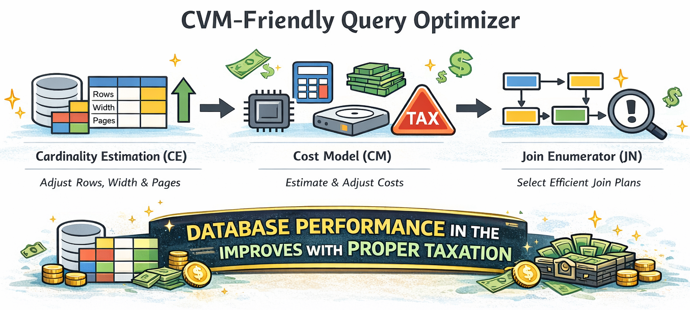

# TaxCollector: CVM-Friendly Query Optimization for PostgreSQL

**TaxCollector** is a PostgreSQL optimizer enhancement designed for Confidential VMs (CVMs), e.g., AMD SEV-SNP. Instead of changing the security mechanisms, TaxCollector **calibrates optimizer signals and search behavior** so PostgreSQL is more likely to choose **CVM-friendly** execution plans and avoid patterns that become fragile under encrypted execution.

In CVMs we mainly target three recurring sources of overhead:
- **RMP checks** (additional checks along memory access paths)
- **Memory-encryption wall** (bandwidth/latency bottlenecks when execution becomes DRAM-bound)
- **I/O bounce buffers** (extra DMA/SWIOTLB bounce-copy/mapping overhead)

TaxCollector therefore explicitly reasons about three “pressure” units during planning:
- `pages`: a proxy for I/O traffic and page churn
- `rows` and `width`: proxies for encrypted memory footprint and memory traffic


<p align="center">
  
</p>
---

## Components

TaxCollector consists of **three lightweight optimizer calibration components** plus **one controller**. To use it, you must **compile and enable all four modules** in addition to PostgreSQL itself:

### 1) CE — Inflation-based Cardinality Estimation
When an intermediate result’s working set is likely to exceed an effective cache/working-set budget, **CE conservatively inflates** internal size signals (`rows/width/pages`) so the optimizer is less likely to pick plans that look cheap in KVM but trigger overflow-driven churn in CVMs (which often amplifies RMP/bounce-buffer/memory-wall overheads together).

### 2) CM — TEE-aware Cost Model
**CM** keeps PostgreSQL’s cost structure but adds calibrated **CVM taxes** for operators and access patterns that are disproportionately expensive in encrypted settings (e.g., pointer-chasing and cache-unfriendly paths). This prevents the optimizer from over-preferring CVM-fragile operator choices.

### 3) JN — Risk-based DP Join Enumerator
**JN** addresses a key mismatch in DP join enumeration: CVM penalties often become apparent only later, but early DP pruning is irreversible. JN adds a lightweight **risk score** in early DP layers and performs **beam pruning**, avoiding CVM-fragile join sequences before they dominate the DP table.

### 4) AS — Adaptive Selector (controller)
**AS** is a controller that decides whether to enable {CE, CM, JN} **per query** rather than always enabling everything. It combines:
- a rule-based selector (feature-driven decision), and
- a lightweight cache to reuse the best component combination for repeated queries (reducing planning overhead and avoiding over-calibration).

---

## Code Layout

All four modules live under the PostgreSQL source tree:

- `contrib/tee_cardinality_estimation`
- `contrib/tee_cost_model`
- `contrib/tee_join_enumerator`
- `contrib/tee_adaptive_selector`

---

---

## Build PostgreSQL (TaxCollector Fork) from Source

This repository vendors PostgreSQL and places TaxCollector modules under `contrib/`. A typical end-to-end build flow is:

```bash
# 1) Get the code
git clone git@github.com:Tsihan/taxcollector.git
cd taxcollector

# 2) Configure & build PostgreSQL
./configure --prefix=/YourHomeDirectory/taxcollector
make
make install

# 3) Add the installed PostgreSQL to PATH (so pg_config/psql/pg_ctl are found)
echo 'export PATH=/YourHomeDirectory/taxcollector/bin:$PATH' >> ~/.bashrc
source ~/.bashrc

# 4) Initialize and start a local database cluster
pg_ctl -D /YourHomeDirectory/databases initdb
pg_ctl -D /YourHomeDirectory/databases -l logfile start
```

### Disable GEQO (Genetic Query Optimizer)

Disable GEQO in the configuration file at:

- `/YourHomeDirectory/databases/postgresql.conf`

Add (or edit) the following line:

```conf
geqo = off
```

Then restart PostgreSQL for the change to take effect.


## Build & Enable

> In addition to PostgreSQL itself, you must compile and enable the four modules above.

### 1) Build / Install the 4 modules

If you are building in-tree (inside the PostgreSQL source tree), you can compile and install each module like:

```bash
cd contrib/tee_cardinality_estimation && make && make install
cd contrib/tee_cost_model && make && make install
cd contrib/tee_join_enumerator && make && make install
cd contrib/tee_adaptive_selector && make && make install
```

> Notes:
> - The exact build flow depends on whether you use in-tree builds or PGXS.
> - If you build against an external PostgreSQL installation, ensure `PG_CONFIG` / `PATH` points to the intended `pg_config` and server installation.

### 2) Enable via `shared_preload_libraries`

In `postgresql.conf`, add (a restart is required after changing this):

```conf
# Example (change requires restart):
# shared_preload_libraries = 'pg_hint_plan,tee_cardinality_estimation,tee_cost_model,tee_join_enumerator,tee_adaptive_selector'
```

### 3) Restart PostgreSQL

Restart the server so the preloaded modules take effect. Then verify:

```sql
SHOW shared_preload_libraries;
```

---

## Workflow (Offline tuning + Online execution)

TaxCollector follows an “offline tuning + online execution” workflow:
- **Offline**: run workloads under KVM and CVM, collect query/operator statistics, and calibrate parameters used by the components.
- **Online**: for each incoming query, AS first checks its cache; if there is a hit, it reuses the historically best component combination. Otherwise, AS selects a {CE, CM, JN} configuration for this query, plans and executes it, and records outcomes for future reuse.

---

## Evaluation Data

We store our **knob-tuning results** under:

- `/evaluation_data`

This folder contains the parameter-sweep / tuning outputs used in our evaluation.

---

## Benchmarks

We store JOB, CEB, Stack, and TPC-DS queries we use under:

- `/workloads`

**Workload sources:**
- **Stack** workload is based on the workload used by **Bao** (SIGMOD 2021).
- **CEB** (Cardinality Estimation Benchmark) queries follow the setup used by **Flow-Loss** (PVLDB 2021).

See *Workload References* below for BibTeX entries.

---

## Acknowledgements

We thank **Bergmann et al.** for providing a modified **PostgreSQL 16.9** codebase that makes it easier to develop and experiment with optimizer components on top of PostgreSQL:

```bibtex
@article{Bergmann2025Elephant,
  title={An elephant under the microscope: Analyzing the interaction of optimizer components in postgresql},
  author={Bergmann, Rico and Hartmann, Claudio and Habich, Dirk and Lehner, Wolfgang},
  journal={Proceedings of the ACM on Management of Data},
  volume={3},
  number={1},
  pages={1--28},
  year={2025},
  publisher={ACM New York, NY, USA}
}
```

---

## Workload References

```bibtex
@inproceedings{marcus2021bao,
  title={Bao: Making learned query optimization practical},
  author={Marcus, Ryan and Negi, Parimarjan and Mao, Hongzi and Tatbul, Nesime and Alizadeh, Mohammad and Kraska, Tim},
  booktitle={Proceedings of the 2021 International Conference on Management of Data},
  pages={1275--1288},
  year={2021}
}

@article{flowloss,
  author = {Negi, Parimarjan and Marcus, Ryan and Kipf, Andreas and Mao, Hongzi and Tatbul, Nesime and Kraska, Tim and Alizadeh, Mohammad},
  title = {Flow-Loss: Learning Cardinality Estimates That Matter},
  year = {2021},
  issue_date = {July 2021},
  publisher = {VLDB Endowment},
  volume = {14},
  number = {11},
  issn = {2150-8097},
  url = {https://doi.org/10.14778/3476249.3476259},
  doi = {10.14778/3476249.3476259},
  journal = {Proc. VLDB Endow.},
  month = {jul},
  pages = {2019–2032},
  numpages = {14}
}
```
